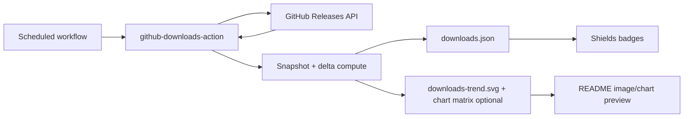
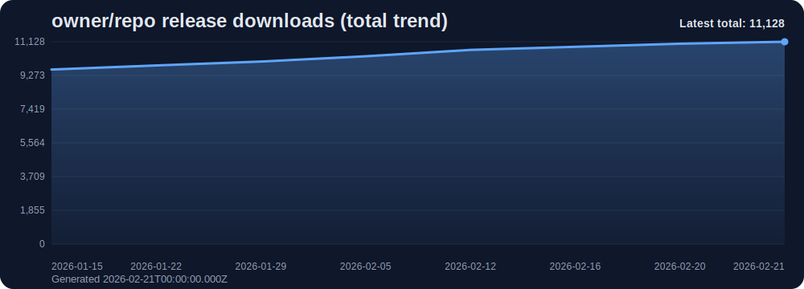
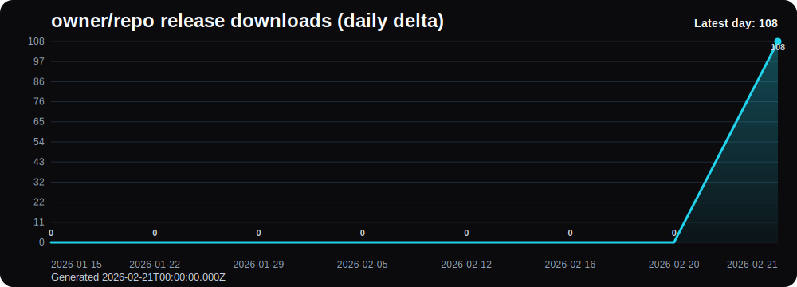
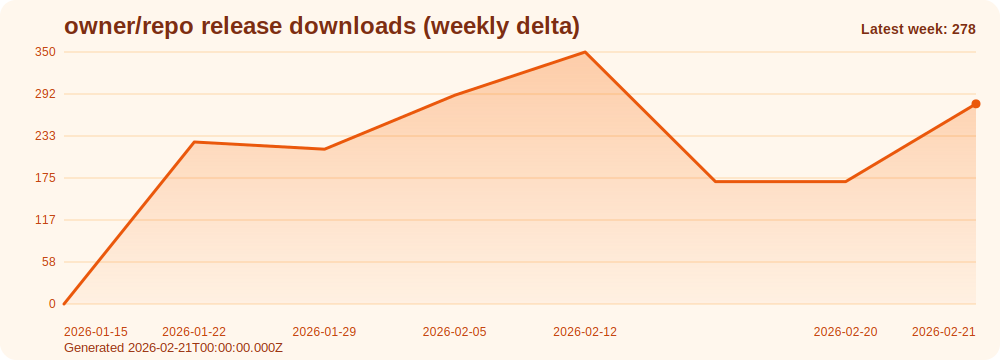
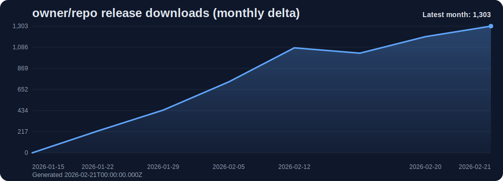
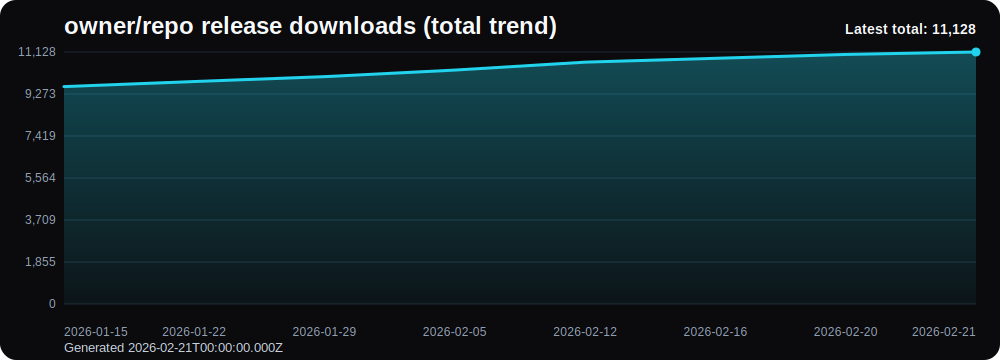
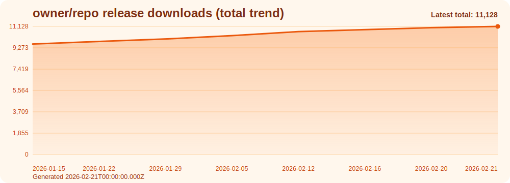

# justagwas/github-downloads-action

[](https://github.com/justagwas/github-downloads-action/releases)
[](LICENSE)
[](https://docs.github.com/en/actions)
[](https://github.com/justagwas/github-downloads-action/actions/workflows/compat-check.yml)
[](https://github.com/justagwas/github-downloads-action/actions/workflows/actionlint.yml)
[](https://github.com/justagwas/github-downloads-action/actions/workflows/codeql.yml)

This GitHub Action tracks release download counts and publishes them as static JSON your badges can read.

No separate API server needed.

## Quick setup (about 30 seconds)

1. Add `.github/workflows/gh-dl-daily.yml` from the manual quick start below.
2. Run `gh-dl-daily` once with `workflow_dispatch`.
3. Add one or both badges to your README (replace `_OWNER_`/`_REPOSITORY_`):

```md


```

## Interactive site

If you want a visual setup flow (with live badge/chart generators), use:

- Project page: `https://justagwas.com/projects/gda`
- Generator Lab: `https://justagwas.com/projects/gda#generator-lab`
- The generator supports chart date formats, generated footer toggle, and title mode presets.

Note: private repositories usually cannot render public badges.
Note: this repository has little/no release-asset activity, so preview values are expected to be low.

## Why this action exists

GitHub does not give you built-in daily/weekly/monthly release download stats.

Polling the GitHub Releases API on every badge request is noisy and can hit rate limits.

This action keeps things simple:

- each repository computes its own totals on a schedule
- it publishes one static JSON file
- badges read that file URL

Result: simple, scalable, and low-maintenance.

## How it works (short version)

1. The action reads all releases for a target repo and sums release asset `download_count` values.
2. It merges today's total into a rolling snapshot series (`window_days`, default `45`).
3. It computes `total`, `day` (1-day delta), `week` (7-day delta), and `month` (30-day delta).
4. It marks `partial.day/week/month` when exact baseline coverage is missing.
5. It writes JSON to `output_branch:output_path` (default `gh-pages:gh-dl/downloads.json`).
6. Optional: it can also publish static SVG charts (`publish_chart: "true"`) across chart type/theme combinations.

## Architecture at a glance



## About the source URL

Your badge source is simply the public URL of the JSON file this action publishes.

Default source URL pattern:

```text
https://raw.githubusercontent.com/<_OWNER_>/<_REPO_>/gh-pages/gh-dl/downloads.json
```

`gh-pages` here is just a storage branch for generated data. You do not need to enable GitHub Pages site hosting for this to work.

`raw` vs `jsDelivr`:

- `raw.githubusercontent.com` (default in this README): direct and simple.
- `cdn.jsdelivr.net`: often faster globally, but cache lag can be longer in some cases.

Alternative jsDelivr pattern:

```text
https://cdn.jsdelivr.net/gh/<_OWNER_>/<_REPO_>@gh-pages/gh-dl/downloads.json
```

## Manual quick start (copy-paste)

Create `.github/workflows/gh-dl-daily.yml`:

```yaml
name: gh-dl-daily

on:
  schedule:
    - cron: "0 3 * * *"
  workflow_dispatch:

concurrency:
  group: gh-dl-${{ github.repository }}-${{ github.ref }}
  cancel-in-progress: false

permissions:
  contents: write

jobs:
  publish-downloads:
    runs-on: ubuntu-latest
    steps:
      - uses: actions/checkout@de0fac2e4500dabe0009e67214ff5f5447ce83dd

      - name: Publish downloads.json to gh-pages
        uses: justagwas/github-downloads-action@v1
        with:
          token: ${{ secrets.GITHUB_TOKEN }}
          window_days: "45"
          enable_hourly_profile: "false"
          output_branch: "gh-pages"
          output_path: "gh-dl/downloads.json"
          min_refresh_minutes: "0"
          publish_chart: "false"
          chart_output_path: "gh-dl/downloads-trend.svg"
```

Optional hourly mode:

- set `enable_hourly_profile: "true"`
- schedule hourly (`0 * * * *`)
- optionally set `min_refresh_minutes` to reuse a fresh cached total and reduce API load
- see **Charts (optional)** below for chart setup and preview.

## Quick install checklist

1. Add `.github/workflows/gh-dl-daily.yml` from this README.
2. Run `gh-dl-daily` once via `workflow_dispatch`.
3. Open your source URL and confirm it returns JSON:
   `https://raw.githubusercontent.com/<_OWNER_>/<_REPO_>/gh-pages/gh-dl/downloads.json`
4. Add one badge to README using that same URL.
5. Confirm badge value appears; then check again after next scheduled run.

## Warm-up period (important)

This action needs a bit of history before week/month deltas become exact.

- New repos often show `partial.week = true` and `partial.month = true` at first.
- `day/week/month` can look lower than expected while history builds.
- This is expected behavior, not a bug.

Typical first 30 days:

| Snapshot age | `partial.day` | `partial.week` | `partial.month` | Notes |
|---|---|---|---|---|
| Day 0-1 | `true` | `true` | `true` | first run has no prior baseline |
| Day 2-7 | usually `false` | `true` | `true` | day settles first |
| Day 8-30 | usually `false` | usually `false` | `true` | week settles if snapshots are daily |
| Day 31+ | usually `false` | usually `false` | usually `false` | exact if no gaps |

## README badge examples (copy-paste)

Replace `_OWNER_` and `_REPOSITORY_`.

### Total downloads

```md

```

Preview:


### Daily downloads

```md

```

Preview:


### Weekly downloads

```md

```

Preview:


### Monthly downloads

```md

```

Preview:


### Profile mode (daily/hourly) badge

```md

```

Preview:


### Attribution

```md
<sub>Powered by <a href="https://github.com/justagwas/github-downloads-action">github-downloads-action</a></sub>
```

Preview:

<sub>Powered by <a href="https://github.com/justagwas/github-downloads-action">github-downloads-action</a></sub>

## Charts (optional)

You can publish static SVG charts and embed them directly in your README.

Enable chart publishing in workflow:

```yaml
with:
  publish_chart: "true"
  chart_output_path: "gh-dl/downloads-trend.svg"
  chart_types: "total-trend,daily,weekly,monthly"
  chart_themes: "black,slate,orange"
  charts_output_dir: "gh-dl/charts"
  chart_width: "1000"
  chart_height: "360"
  chart_zero_baseline: "true"
  chart_y_ticks: "6"
  chart_x_label_every_days: "0"
  chart_show_value_labels: "false"
  chart_date_label_format: "yyyy-mm-dd"
  chart_show_generated_at: "true"
  chart_title_mode: "default"
  chart_title_text: ""
```

Chart options:

- `chart_types`: `total-trend`, `daily`, `weekly`, `monthly`
- `chart_themes`: `black`, `slate`, `orange`
- `chart_width`, `chart_height`: pixel dimensions for all published SVG files
- `chart_zero_baseline`: when `true`, Y-axis starts at 0 (enabled by default)
- `chart_y_ticks`: Y-axis interval count (`2..12`) for denser/sparser value lines
- `chart_x_label_every_days`: date label spacing (`0` = auto spacing, `1` = every day)
- `chart_show_value_labels`: render per-point numeric values above the line
- `chart_date_label_format`: date labels (`yyyy-mm-dd`, `yy/mm/dd`, `dd/mm`, `mm/dd`, `none`)
- `chart_show_generated_at`: show/hide `Generated <date>` footer text
- `chart_title_mode`: title style (`default`, `custom`, `none`)
- `chart_title_text`: custom title text (required only when `chart_title_mode: "custom"`)
- `chart_output_path`: primary chart path (first `chart_types` + first `chart_themes`)
- `charts_output_dir`: directory for all matrix charts (`<type>--<theme>.svg`)

Note: `chart_output_path` publishes one primary chart, while `charts_output_dir` publishes the full chart matrix.
Note: for safety, `output_path` cannot overlap any chart output file when `publish_chart` is enabled.
Implementation note: chart types/themes/date/title enums are centralized in `src/lib/chart-config.js`.

Dense chart example (more Y values, daily date labels, and numbers):

```yaml
with:
  publish_chart: "true"
  chart_types: "daily"
  chart_themes: "black"
  chart_zero_baseline: "true"
  chart_y_ticks: "10"
  chart_x_label_every_days: "1"
  chart_show_value_labels: "true"
  chart_date_label_format: "dd/mm"
  chart_show_generated_at: "true"
  chart_title_mode: "custom"
  chart_title_text: "My repo daily downloads"
```

Simple chart presets:

- Clean default trend: keep defaults (`chart_zero_baseline: "true"`, `chart_y_ticks: "6"`, `chart_x_label_every_days: "0"`)
- Detail-heavy daily chart: set `chart_types: "daily"`, `chart_y_ticks: "10"`, `chart_x_label_every_days: "1"`, `chart_show_value_labels: "true"`
- Minimal labels (less clutter): keep `chart_show_value_labels: "false"` and use `chart_x_label_every_days: "7"` or higher

Embed the primary chart:

```md

```

Embed a matrix chart directly:

```md

```

Preview gallery (4 chart types):






Theme preview (same chart, 3 themes):





## Chart generator (copy-paste)

Generate Markdown image lines for selected chart types/themes.

```bash
node -e "const owner='_OWNER_';const repo='_REPOSITORY_';const types='total-trend,daily,weekly,monthly'.split(',');const themes='black,slate,orange'.split(',');const base=`https://raw.githubusercontent.com/${owner}/${repo}/gh-pages`;for(const t of types){for(const th of themes){console.log(``);}}"
```

PowerShell variant:

```powershell
$owner = "_OWNER_"
$repo = "_REPOSITORY_"
$types = @("total-trend", "daily", "weekly", "monthly")
$themes = @("black", "slate", "orange")
$base = "https://raw.githubusercontent.com/$owner/$repo/gh-pages"
foreach ($type in $types) {
  foreach ($theme in $themes) {
    Write-Output ""
  }
}
```

## Badge generator (copy-paste)

Generate all badge markdown lines for a repo.

```bash
node -e "const owner='_OWNER_';const repo='_REPOSITORY_';const src=`https://raw.githubusercontent.com/${owner}/${repo}/gh-pages/gh-dl/downloads.json`;const u=encodeURIComponent(src);const defs=[['total','$.stats.total','0A7EA4'],['day','$.stats.day','1E8E3E'],['week','$.stats.week','0069C2'],['month','$.stats.month','B26A00'],['profile','$.profile.defaultMode','5E35B1']];for(const[d,q,c]of defs){const label=encodeURIComponent(`downloads/${d}`);const query=encodeURIComponent(q);console.log(``);}"
```

PowerShell variant:

```powershell
$owner = "_OWNER_"
$repo = "_REPOSITORY_"
$src = "https://raw.githubusercontent.com/$owner/$repo/gh-pages/gh-dl/downloads.json"
$u = [uri]::EscapeDataString($src)
$defs = @(
  @{ Name = "total"; Query = "$.stats.total"; Color = "0A7EA4" },
  @{ Name = "day"; Query = "$.stats.day"; Color = "1E8E3E" },
  @{ Name = "week"; Query = "$.stats.week"; Color = "0069C2" },
  @{ Name = "month"; Query = "$.stats.month"; Color = "B26A00" },
  @{ Name = "profile"; Query = "$.profile.defaultMode"; Color = "5E35B1" }
)
foreach ($d in $defs) {
  $label = [uri]::EscapeDataString("downloads/$($d.Name)")
  $query = [uri]::EscapeDataString($d.Query)
  Write-Output ")"
}
```

## Published JSON schema

Schema file: `schema/downloads.schema.json`

The action writes `schemaVersion: "1"` using this structure:

```json
{
  "schemaVersion": "1",
  "owner": "Justagwas",
  "repo": "repository",
  "visibility": "public",
  "generatedAt": "2026-02-18T10:00:00.000Z",
  "stats": {
    "total": 9412,
    "day": 16,
    "week": 159,
    "month": 802
  },
  "partial": {
    "day": false,
    "week": false,
    "month": true
  },
  "snapshots": {
    "windowDays": 45,
    "count": 31,
    "firstDate": "2026-01-18",
    "lastDate": "2026-02-18",
    "series": {
      "2026-02-18": 9412
    }
  },
  "profile": {
    "defaultMode": "daily",
    "hourlyEnabled": false
  }
}
```

## Stability guarantees

For the `v1` major line, the project follows these stability expectations:

- Existing output keys in `downloads.json` will remain stable.
- `schemaVersion` changes only for explicit schema migrations.
- Existing action inputs and outputs are not removed without a major version bump.
- Workflow template updates are additive or documented in release notes when behavior changes.

## Inputs

| Input | Required | Default | Type | Notes |
|---|---|---|---|---|
| `token` | No | empty | string | GitHub token for API + publish (`${{ secrets.GITHUB_TOKEN }}` recommended) |
| `owner` | No | workflow repo owner | string | Target repo owner |
| `repo` | No | workflow repo name | string | Target repo name |
| `window_days` | No | `45` | integer | Allowed range: `1..3650` |
| `enable_hourly_profile` | No | `false` | boolean | true/false, 1/0, yes/no accepted |
| `output_branch` | No | `gh-pages` | string | Must be a valid git branch name |
| `output_path` | No | `gh-dl/downloads.json` | string | Repo-relative file path; traversal blocked |
| `min_refresh_minutes` | No | `0` | integer | Optional cache window in minutes (`0..10080`); when >0, a fresh prior total can be reused |
| `publish_chart` | No | `false` | boolean | When true, publishes static SVG charts |
| `chart_output_path` | No | `gh-dl/downloads-trend.svg` | string | Repo-relative path for the SVG chart |
| `chart_types` | No | `total-trend` | csv | Chart types list: `total-trend,daily,weekly,monthly` |
| `chart_themes` | No | `slate` | csv | Chart themes list: `black,slate,orange` |
| `charts_output_dir` | No | `gh-dl/charts` | string | Repo-relative directory where matrix chart files are written |
| `chart_width` | No | `1000` | integer | Chart width in pixels (`640..4096`) |
| `chart_height` | No | `360` | integer | Chart height in pixels (`240..2160`) |
| `chart_zero_baseline` | No | `true` | boolean | When true, Y-axis starts at 0 |
| `chart_y_ticks` | No | `6` | integer | Y-axis interval count (`2..12`) |
| `chart_x_label_every_days` | No | `0` | integer | Date label spacing in days (`0..365`, `0` means auto) |
| `chart_show_value_labels` | No | `false` | boolean | When true, draws numeric labels above points |
| `chart_date_label_format` | No | `yyyy-mm-dd` | enum | Date labels: `yyyy-mm-dd`, `yy/mm/dd`, `dd/mm`, `mm/dd`, `none` |
| `chart_show_generated_at` | No | `true` | boolean | When true, shows `Generated <date>` footer |
| `chart_title_mode` | No | `default` | enum | `default` (`owner/repo`), `custom` (uses `chart_title_text`), or `none` |
| `chart_title_text` | No | empty | string | Custom title shown when `chart_title_mode=custom` (max 120 chars) |

## Outputs

- `owner`, `repo`, `generated_at`
- `total`, `day`, `week`, `month`
- `partial_day`, `partial_week`, `partial_month`
- `total_source` (`api` or `cache`)
- `chart_output_path`
- `chart_published` (`true` when one or more chart SVGs were updated in this run)
- `chart_published_count`, `chart_total_count`
- `chart_files` (comma-separated generated chart paths)
- `output_branch`, `output_path`
- `published` (`true` when file was updated, `false` when no material change was detected)

## Testing

- Style checks: `scripts/style-check.js`
- Public test suite: `tests/run-tests.js`
- Compatibility checks: `compat/run-compat.js`
- Local command: `npm test`

## Partial flags (plain language)

- `partial: false` means the action found an exact baseline snapshot for that range.
- `partial: true` means coverage is still warming or has gaps, so the range delta uses best available baseline.

For new repos, expect `partial.week/month = true` until enough days are collected.

## Known limits

- Warm-up period: `week` and `month` may be partial until enough history exists.
- Snapshot model: values are based on snapshot deltas, not event-level analytics.
- Badge caching: GitHub Raw/Shields caching can delay visible updates.
- Manual reruns on the same day may return `published=false` when there is no material change.

## Troubleshooting

| Symptom | Likely cause | Exact fix |
|---|---|---|
| Badge shows no value | JSON URL is wrong or file not published yet | Open raw JSON URL directly and confirm it returns JSON |
| Badge says `resource not found` | Repo is private | Publish data from a public repo/branch for public badges |
| `partial.week` or `partial.month` is `true` | Warm-up period or missing baseline snapshots | Wait for enough snapshots; this is expected during early runs |
| Values look very low | Repo has little/no release-asset downloads | Confirm releases include downloadable assets and real download traffic |
| Workflow reports no commit | No material change between previous and current payload | Check `published` output; this is expected when totals did not change |
| Push/write fails on `gh-pages` | Missing write permission or branch protection blocks Actions | Set `permissions: contents: write`, pass `token`, allow Actions to push or use another branch |
| Wrong target repository data | Owner/repo auto-resolution mismatch | Set `owner` and `repo` explicitly in workflow `with` |

## FAQ

### Why are my preview values so low?

If your repository has few or no release-asset downloads, totals and deltas will naturally stay low. This repository itself has minimal release-asset activity, so its preview values are intentionally modest.

## Repo templates

- `templates/workflows/gh-dl-daily.yml`
- `templates/workflows/gh-dl-hourly.yml`
- `templates/workflows/gh-dl-daily-with-chart.yml`

Use `gh-dl-daily-with-chart.yml` when you want one workflow to publish both badge JSON and chart SVG outputs.

## Issue labels

- Label definitions: `.github/labels.json`
- Label sync workflow: `.github/workflows/sync-labels.yml`
- Suggested issue labels for triage:

| Label | Purpose |
|---|---|
| `bug` | Behavior is incorrect and needs a fix |
| `enhancement` | Feature or UX improvement |
| `question` | Usage/setup question |
| `documentation` | Docs-only improvement |
| `good first issue` | Beginner-friendly task |
| `help wanted` | Maintainers are actively looking for contributors |
| `breaking-change` | Behavior/input/output change requiring migration |
| `performance` | API load/runtime efficiency work |

## Community and support

- Contributing guide: `.github/CONTRIBUTING.md`
- Code owners: `.github/CODEOWNERS`
- Code of conduct: `.github/CODE_OF_CONDUCT.md`
- Security policy: `.github/SECURITY.md`
- Support policy: `SUPPORT.md`
- Privacy notice: `PRIVACY.md`
- Marketplace EULA: `EULA.md`

## License

Licensed under the Apache License 2.0 (Apache-2.0).

See [`LICENSE`](LICENSE).
