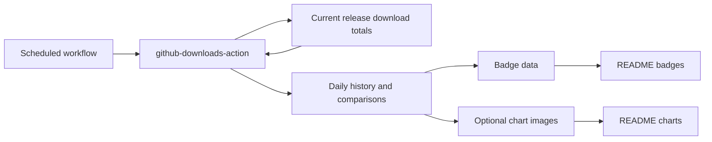
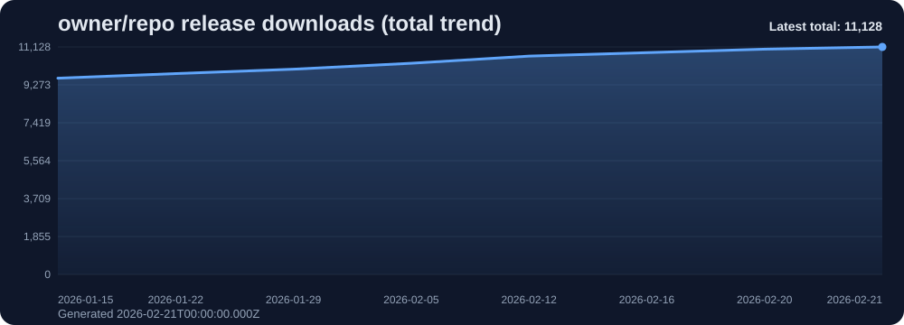
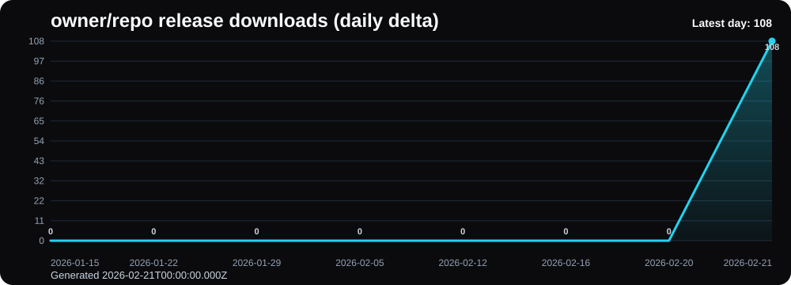
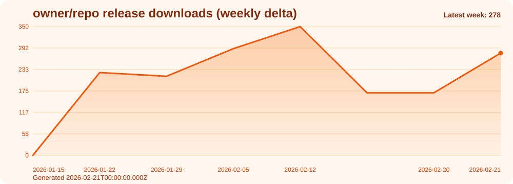
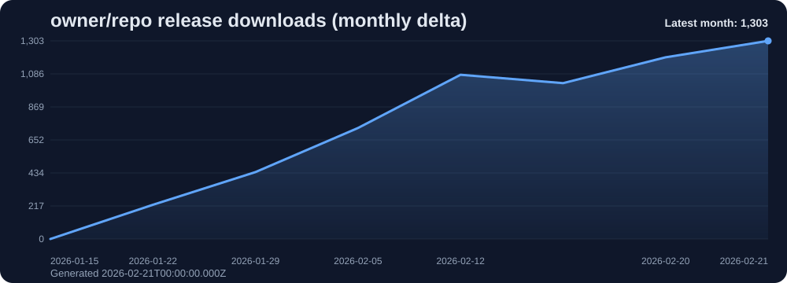
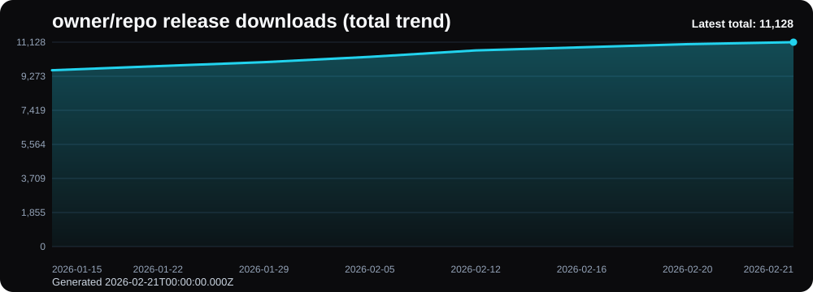
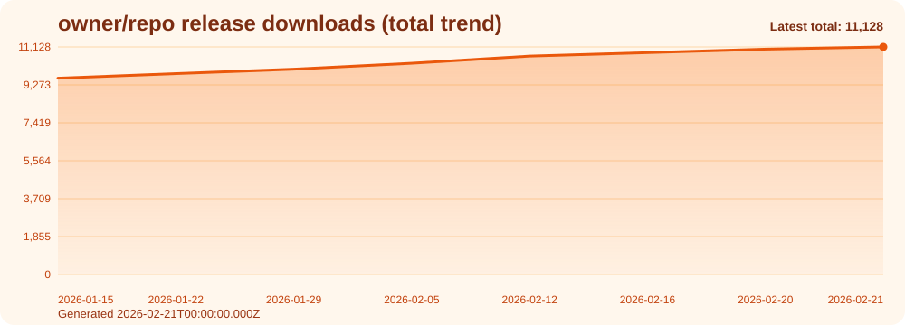

# justagwas/github-downloads-action

[](https://github.com/justagwas/github-downloads-action/releases)
[](LICENSE)
[](https://docs.github.com/en/actions)
[](https://github.com/justagwas/github-downloads-action/actions/workflows/compat-check.yml)
[](https://github.com/justagwas/github-downloads-action/actions/workflows/actionlint.yml)
[](https://github.com/justagwas/github-downloads-action/actions/workflows/codeql.yml)

Keep track of GitHub Release downloads over time and present the results as clean badges or optional charts.

The history stays in your repository, with no separate statistics server to maintain.

## Start here (quick install)

Choose one setup template:

| Setup | Use when | Template |
|---|---|---|
| Daily badges | You want a simple daily download total | https://github.com/justagwas/github-downloads-action/blob/main/templates/workflows/gh-dl-daily.yml |
| More frequent updates | You want the current day to refresh more often | https://github.com/justagwas/github-downloads-action/blob/main/templates/workflows/gh-dl-hourly.yml |
| Daily badges and charts | You want download numbers and visual trends | https://github.com/justagwas/github-downloads-action/blob/main/templates/workflows/gh-dl-daily-with-chart.yml |

1. Download or copy the template that matches the result you want.
2. Place the file in the repository under `.github/workflows/`.
3. Commit and push.
4. Open the repository's **Actions** tab and select **Run workflow** once.
5. Add one or both badges to the README, replacing `_OWNER_` and `_REPOSITORY_`:

```md


```

Marketplace listing: https://github.com/marketplace/actions/github-downloads-action

Public badges need a publicly readable result file. Private repositories usually cannot display them to signed out visitors.

This repository has little release file activity, so its example values are expected to be modest.

## Why this action exists

GitHub shows how many times each file attached to a release has been downloaded, but it does not show how that total changed over time.

GitHub Downloads Action keeps that short history for you. On a schedule you choose, it reads the current numbers, saves the total for the day, and updates the small files used by your badges and charts.

Everything remains in the repository, making the result easy to inspect, reuse, and remove without depending on a hosted analytics account.

## How it works (short version)

1. Read the download number for every file attached to the repository's GitHub Releases.
2. Add those numbers together and save one total for the current day.
3. Compare the available history to show one day, seven day, and thirty day changes.
4. Clearly mark a comparison as partial when there is not yet enough history for the complete period.
5. Publish the result to `gh-pages:gh-dl/downloads.json` by default.
6. Optionally publish chart images from the same history.

## Architecture at a glance


```mermaid
flowchart LR
  A[Scheduled workflow] --> B[github-downloads-action]
  B --> C[Current release download totals]
  C --> B
  B --> D[Daily history and comparisons]
  D --> E[Badge data]
  D --> F[Optional chart images]
  E --> G[README badges]
  F --> H[README charts]
```

## About the source URL

The badge reads the small public data file produced by the action. With the default settings, its address follows this pattern:

Default source URL pattern:

```text
https://raw.githubusercontent.com/<_OWNER_>/<_REPO_>/gh-pages/gh-dl/downloads.json
```

`gh-pages` is simply the branch used to store the generated files. You do not need to create or enable a GitHub Pages website.

`raw` vs `jsDelivr`:

- `raw.githubusercontent.com` is direct and simple, and is used by the examples in this README.
- `cdn.jsdelivr.net` can be faster in some locations, although updates may take longer to appear.

Alternative jsDelivr pattern:

```text
https://cdn.jsdelivr.net/gh/<_OWNER_>/<_REPO_>@gh-pages/gh-dl/downloads.json
```

## Warm-up period (important)

Weekly and monthly comparisons need earlier daily totals. A new setup therefore takes time to build a complete history.

- Daily comparisons can become complete after two consecutive dates.
- Weekly comparisons need eight daily dates.
- Monthly comparisons need thirty one daily dates.
- A missing scheduled run can make a comparison partial again.

A partial value is not a failure. It is the best comparison available from the dates collected so far.

Typical first 30 days:

| Snapshot age | `partial.day` | `partial.week` | `partial.month` | Notes |
|---|---|---|---|---|
| Day 0-1 | `true` | `true` | `true` | The first run has no earlier total |
| Day 2-7 | usually `false` | `true` | `true` | Daily comparison becomes available first |
| Day 8-30 | usually `false` | usually `false` | `true` | Weekly comparison becomes available next |
| Day 31+ | usually `false` | usually `false` | usually `false` | Complete when the required dates have no gaps |

## README badge examples (copy-paste)

Replace `_OWNER_` and `_REPOSITORY_`.

### Total downloads

```md

```

Preview:


### Daily downloads

```md

```

Preview:


### Weekly downloads

```md

```

Preview:


### Monthly downloads

```md

```

Preview:


### Profile mode (daily/hourly) badge

```md

```

Preview:


### Attribution

```md
<sub>Powered by <a href="https://github.com/justagwas/github-downloads-action">github-downloads-action</a></sub>
```

Preview:

<sub>Powered by <a href="https://github.com/justagwas/github-downloads-action">github-downloads-action</a></sub>

## Charts (optional)

You can publish static SVG charts and embed them directly in your README.

Enable chart publishing in workflow:

```yaml
with:
  publish_chart: "true"
  chart_output_path: "gh-dl/downloads-trend.svg"
  chart_types: "total-trend,daily,weekly,monthly"
  chart_themes: "black,slate,orange"
  charts_output_dir: "gh-dl/charts"
  chart_width: "1000"
  chart_height: "360"
  chart_zero_baseline: "true"
  chart_y_ticks: "6"
  chart_x_label_every_days: "0"
  chart_show_value_labels: "false"
  chart_date_label_format: "yyyy-mm-dd"
  chart_show_generated_at: "true"
  chart_title_mode: "default"
  chart_title_text: ""
```

Chart options:

- `chart_types`: `total-trend`, `daily`, `weekly`, `monthly`
- `chart_themes`: `black`, `slate`, `orange`
- `chart_width`, `chart_height`: pixel dimensions for all published SVG files
- `chart_zero_baseline`: when `true`, Y-axis starts at 0 (enabled by default)
- `chart_y_ticks`: Y-axis interval count (`2..12`) for denser/sparser value lines
- `chart_x_label_every_days`: date label spacing (`0` = auto spacing, `1` = every day)
- `chart_show_value_labels`: render per-point numeric values above the line
- `chart_date_label_format`: date labels (`yyyy-mm-dd`, `yy/mm/dd`, `dd/mm`, `mm/dd`, `none`)
- `chart_show_generated_at`: show/hide `Generated <date>` footer text
- `chart_title_mode`: title style (`default`, `custom`, `none`)
- `chart_title_text`: custom title text (required only when `chart_title_mode: "custom"`)
- `chart_output_path`: primary chart path (first `chart_types` + first `chart_themes`)
- `charts_output_dir`: directory for all matrix charts (`<type>--<theme>.svg`)

Note: `chart_output_path` publishes one primary chart, while `charts_output_dir` publishes the full chart matrix.  
Note: for safety, `output_path` cannot overlap any chart output file when `publish_chart` is enabled.  
Implementation note: chart types/themes/date/title enums are centralized in `src/lib/chart-config.js`.  

Dense chart example (more Y values, daily date labels, and numbers):

```yaml
with:
  publish_chart: "true"
  chart_types: "daily"
  chart_themes: "black"
  chart_zero_baseline: "true"
  chart_y_ticks: "10"
  chart_x_label_every_days: "1"
  chart_show_value_labels: "true"
  chart_date_label_format: "dd/mm"
  chart_show_generated_at: "true"
  chart_title_mode: "custom"
  chart_title_text: "My repo daily downloads"
```

Simple chart presets:

- Clean default trend: keep defaults (`chart_zero_baseline: "true"`, `chart_y_ticks: "6"`, `chart_x_label_every_days: "0"`)
- Detail-heavy daily chart: set `chart_types: "daily"`, `chart_y_ticks: "10"`, `chart_x_label_every_days: "1"`, `chart_show_value_labels: "true"`
- Minimal labels (less clutter): keep `chart_show_value_labels: "false"` and use `chart_x_label_every_days: "7"` or higher

Embed the primary chart:

```md

```

Embed a matrix chart directly:

```md

```

Preview gallery (4 chart types):






Theme preview (same chart, 3 themes):





## Chart generator (copy-paste)

Generate Markdown image lines for selected chart types/themes.

```bash
node -e "const owner='_OWNER_';const repo='_REPOSITORY_';const types='total-trend,daily,weekly,monthly'.split(',');const themes='black,slate,orange'.split(',');const base=`https://raw.githubusercontent.com/${owner}/${repo}/gh-pages`;for(const t of types){for(const th of themes){console.log(``);}}"
```

PowerShell variant:

```powershell
$owner = "_OWNER_"
$repo = "_REPOSITORY_"
$types = @("total-trend", "daily", "weekly", "monthly")
$themes = @("black", "slate", "orange")
$base = "https://raw.githubusercontent.com/$owner/$repo/gh-pages"
foreach ($type in $types) {
  foreach ($theme in $themes) {
    Write-Output ""
  }
}
```

## Badge generator (copy-paste)

Generate all badge markdown lines for a repo.

```bash
node -e "const owner='_OWNER_';const repo='_REPOSITORY_';const src=`https://raw.githubusercontent.com/${owner}/${repo}/gh-pages/gh-dl/downloads.json`;const u=encodeURIComponent(src);const defs=[['total','$.stats.total','0A7EA4'],['day','$.stats.day','1E8E3E'],['week','$.stats.week','0069C2'],['month','$.stats.month','B26A00'],['profile','$.profile.defaultMode','5E35B1']];for(const[d,q,c]of defs){const label=encodeURIComponent(`downloads/${d}`);const query=encodeURIComponent(q);console.log(``);}"
```

PowerShell variant:

```powershell
$owner = "_OWNER_"
$repo = "_REPOSITORY_"
$src = "https://raw.githubusercontent.com/$owner/$repo/gh-pages/gh-dl/downloads.json"
$u = [uri]::EscapeDataString($src)
$defs = @(
  @{ Name = "total"; Query = "$.stats.total"; Color = "0A7EA4" },
  @{ Name = "day"; Query = "$.stats.day"; Color = "1E8E3E" },
  @{ Name = "week"; Query = "$.stats.week"; Color = "0069C2" },
  @{ Name = "month"; Query = "$.stats.month"; Color = "B26A00" },
  @{ Name = "profile"; Query = "$.profile.defaultMode"; Color = "5E35B1" }
)
foreach ($d in $defs) {
  $label = [uri]::EscapeDataString("downloads/$($d.Name)")
  $query = [uri]::EscapeDataString($d.Query)
  Write-Output ")"
}
```

## Published JSON schema

Schema file: `schema/downloads.schema.json`

The action writes `schemaVersion: "1"` using this structure:

```json
{
  "schemaVersion": "1",
  "owner": "Justagwas",
  "repo": "repository",
  "visibility": "public",
  "generatedAt": "2026-02-18T10:00:00.000Z",
  "stats": {
    "total": 9412,
    "day": 16,
    "week": 159,
    "month": 802
  },
  "partial": {
    "day": false,
    "week": false,
    "month": true
  },
  "snapshots": {
    "windowDays": 45,
    "count": 31,
    "firstDate": "2026-01-18",
    "lastDate": "2026-02-18",
    "series": {
      "2026-02-18": 9412
    }
  },
  "profile": {
    "defaultMode": "daily",
    "hourlyEnabled": false
  }
}
```

## Stability guarantees

For the `v1` major line, the project follows these stability expectations:

- Existing output keys in `downloads.json` will remain stable.
- `schemaVersion` changes only for explicit schema migrations.
- Existing action inputs and outputs are not removed without a major version bump.
- Workflow template updates are additive or documented in release notes when behavior changes.

## Inputs

| Input | Required | Default | Type | Notes |
|---|---|---|---|---|
| `token` | No | empty | string | GitHub token for API + publish (`${{ secrets.GITHUB_TOKEN }}` recommended) |
| `owner` | No | workflow repo owner | string | Target repo owner |
| `repo` | No | workflow repo name | string | Target repo name |
| `window_days` | No | `45` | integer | Allowed range: `1..3650` |
| `enable_hourly_profile` | No | `false` | boolean | true/false, 1/0, yes/no accepted |
| `output_branch` | No | `gh-pages` | string | Must be a valid git branch name |
| `output_path` | No | `gh-dl/downloads.json` | string | Repo-relative file path; traversal blocked |
| `min_refresh_minutes` | No | `0` | integer | Optional cache window in minutes (`0..10080`); when >0, a fresh prior total can be reused |
| `publish_chart` | No | `false` | boolean | When true, publishes static SVG charts |
| `chart_output_path` | No | `gh-dl/downloads-trend.svg` | string | Repo-relative path for the SVG chart |
| `chart_types` | No | `total-trend` | csv | Chart types list: `total-trend,daily,weekly,monthly` |
| `chart_themes` | No | `slate` | csv | Chart themes list: `black,slate,orange` |
| `charts_output_dir` | No | `gh-dl/charts` | string | Repo-relative directory where matrix chart files are written |
| `chart_width` | No | `1000` | integer | Chart width in pixels (`640..4096`) |
| `chart_height` | No | `360` | integer | Chart height in pixels (`240..2160`) |
| `chart_zero_baseline` | No | `true` | boolean | When true, Y-axis starts at 0 |
| `chart_y_ticks` | No | `6` | integer | Y-axis interval count (`2..12`) |
| `chart_x_label_every_days` | No | `0` | integer | Date label spacing in days (`0..365`, `0` means auto) |
| `chart_show_value_labels` | No | `false` | boolean | When true, draws numeric labels above points |
| `chart_date_label_format` | No | `yyyy-mm-dd` | enum | Date labels: `yyyy-mm-dd`, `yy/mm/dd`, `dd/mm`, `mm/dd`, `none` |
| `chart_show_generated_at` | No | `true` | boolean | When true, shows `Generated <date>` footer |
| `chart_title_mode` | No | `default` | enum | `default` (`owner/repo`), `custom` (uses `chart_title_text`), or `none` |
| `chart_title_text` | No | empty | string | Custom title shown when `chart_title_mode=custom` (max 120 chars) |

## Outputs

- `owner`, `repo`, `generated_at`
- `total`, `day`, `week`, `month`
- `partial_day`, `partial_week`, `partial_month`
- `total_source` (`api` or `cache`)
- `chart_output_path`
- `chart_published` (`true` when one or more chart SVGs were updated in this run)
- `chart_published_count`, `chart_total_count`
- `chart_files` (comma-separated generated chart paths)
- `output_branch`, `output_path`
- `published` (`true` when file was updated, `false` when no material change was detected)

## Testing

- Style checks: `scripts/style-check.js`
- Public test suite: `tests/run-tests.js`
- Compatibility checks: `compat/run-compat.js`
- Local command: `npm test`

## Partial flags (plain language)

- `partial: false` means the action has the exact earlier date needed for that comparison.
- `partial: true` means the history is still growing or contains a date gap, so the action uses the closest available earlier total.

For a new setup, expect weekly and monthly comparisons to remain partial until enough daily history has been collected.

## Known limits

- Weekly and monthly comparisons may be partial while the history is still growing.
- The action records daily totals, not individual download events or unique users.
- GitHub Raw and badge caching can delay when a new value becomes visible.
- Running the action again on the same day may produce no new commit when nothing has changed.

## Troubleshooting

| Symptom | Likely cause | Exact fix |
|---|---|---|
| Badge shows no value | JSON URL is wrong or file not published yet | Open raw JSON URL directly and confirm it returns JSON |
| Badge says `resource not found` | Repo is private | Publish data from a public repo/branch for public badges |
| `partial.week` or `partial.month` is `true` | Warm-up period or missing baseline snapshots | Wait for enough snapshots; this is expected during early runs |
| Values look very low | Repo has little/no release-asset downloads | Confirm releases include downloadable assets and real download traffic |
| Workflow reports no commit | No material change between previous and current payload | Check `published` output; this is expected when totals did not change |
| Push/write fails on `gh-pages` | Missing write permission or branch protection blocks Actions | Set `permissions: contents: write`, pass `token`, allow Actions to push or use another branch |
| Wrong target repository data | Owner/repo auto-resolution mismatch | Set `owner` and `repo` explicitly in workflow `with` |

## FAQ

### Why are my preview values so low?

If your repository has few or no release-asset downloads, totals and deltas will naturally stay low. This repository itself has minimal release-asset activity, so its preview values are intentionally modest.

## More guides

- Visual setup + generators:
  - Project page: https://justagwas.com/projects/gda
  - Generator Lab: https://justagwas.com/projects/gda#generator-lab
- Complete documentation: <https://github.com/Justagwas/github-downloads-action/wiki>
- Badge examples: [README badge examples (copy-paste)](#readme-badge-examples-copy-paste)
- Charts and chart options: [Charts (optional)](#charts-optional)
- All inputs: [Inputs](#inputs)
- All outputs: [Outputs](#outputs)
- Troubleshooting: [Troubleshooting](#troubleshooting)
- JSON schema: [Published JSON schema](#published-json-schema)

## Issue labels

- Label definitions: `.github/labels.json`
- Label sync workflow: `.github/workflows/sync-labels.yml`
- Suggested issue labels for triage:

| Label | Purpose |
|---|---|
| `bug` | Behavior is incorrect and needs a fix |
| `enhancement` | Feature or UX improvement |
| `question` | Usage/setup question |
| `documentation` | Docs-only improvement |
| `good first issue` | Beginner-friendly task |
| `help wanted` | Maintainers are actively looking for contributors |
| `breaking-change` | Behavior/input/output change requiring migration |
| `performance` | API load/runtime efficiency work |

## Security

- Use the official [GitHub Marketplace listing](https://github.com/marketplace/actions/github-downloads-action) or a trusted release reference such as `@v1`.
- Grant the workflow only the repository permissions required for its selected output.
- Remember that public badges need a publicly readable result file.
- Refer to the repository [Security Policy](https://github.com/Justagwas/github-downloads-action/security/policy) for private vulnerability reporting.
- Additional policies are available in [`.github/PRIVACY.md`](.github/PRIVACY.md) and [`.github/EULA.md`](.github/EULA.md).

## Contributing

Contributions are welcome.

- Start with [`.github/CONTRIBUTING.md`](.github/CONTRIBUTING.md)
- Follow the shared [Code of Conduct](https://github.com/Justagwas/.github/blob/main/CODE_OF_CONDUCT.md)
- Use [Issues](https://github.com/Justagwas/github-downloads-action/issues) for defect reports, feature proposals, and questions
- Refer to the shared [Support guidance](https://github.com/Justagwas/.github/blob/main/SUPPORT.md)
- Wiki: <https://github.com/Justagwas/github-downloads-action/wiki>

## Contact

- Email: [email@justagwas.com](mailto:email@justagwas.com)
- Website: <https://www.justagwas.com/projects/gda>

## License

Licensed under the Apache License 2.0 (Apache-2.0).

See [`LICENSE`](LICENSE).
